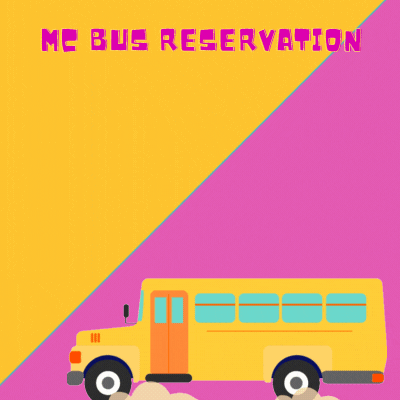

## Bus Reservation
This is our first ever Major Project in CPP

## About the Project
Will add about the project as soon as possible

## Tasks to be Completed
- [x] **Signup and Login**
- [ ] **Buses information**
- [ ] **Reservation();**
- [ ] **Cncellation();**
- [ ] **Change_of_Seats();**
---

  

 

---
<h1 align=center> Project Admins ❤️ </h1>
 <table align="center">
        <tbody>
          <tr>
              <!-- CHARAN -->
            <td align="center">
                <a href="https://github.com/CharanMC-cyb">
                   <b>Charan</b>
               </a>
            </td>
            <td align="right">
                

                    
                

                

                    
                

            </td>
            <!-- MANIDEEP -->
            <td align="center">
                <a href="https://github.com/Manideep-Kunjeti">
                   <b>Manideep</b>
               </a>
            </td>
            <td align="right">
                

                    
                

                

                    
                

            </td>
          </tr>
        </tbody>
      </table>
      
